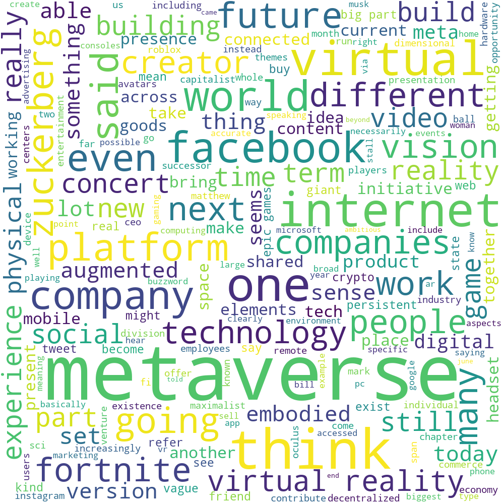

# 🌌 Metaverse-Text-Feature-Extraction

## 👓 About Our Corpus

Thia corpus is basically about the metaverse which is initially invented by the former Facebook  team, A metaverse is a collection of 3D virtual environments designed to foster social interaction. The word is frequently used in futurism and science fiction to represent a potential iteration of the Internet as a single, worldwide virtual environment assisted by the usage of virtual and augmented reality headgear, the metaverse is a big scaled and interoperable network of real-time rendered 3D virtual worlds that can be experienced synchronously and persistently by an effectively infinite number of users with an individual sense of presence and with data continuity, such as identity, history, entitlements,objects, and so on.

## 📐 Corpus Size
Separated into several text file where the total number of words is 2148 only.

## 📑 Text Sample
As June came to an end, Facebook CEO Mark Zuckerberg told his employees about an 
ambitious new initiative. The future of the company would go far beyond its current project of 
building a set of connected social apps and some hardware to support them. Instead, he said, 
Facebook would strive to build a maximalist, interconnected set of experiences straight out of 
sci-fi — a world known as the metaverse. The company’s divisions focused on products for 
communities, creators, commerce, and virtual reality would increasingly work to realize this 
vision, he said in a remote address to employees. “What I think is most interesting is how these 
themes will come together into a bigger idea,” Zuckerberg said. “Our overarching goal across 
all of these initiatives is to help bring the metaverse to life.” The metaverse is having a moment. 
Coined in Snow Crash, Neal Stephenson’s 1992 sci-fi novel, the term refers to a convergence 
of physical, augmented, and virtual reality in a shared online space. Earlier this month, The 
New York Times explored how companies and products including Epic Games’ Fortnite, 
Roblox, and even Animal Crossing: New Horizons increasingly had metaverse-like elements. 
(Epic Games CEO Tim Sweeney has been discussing his desire to contribute to a metaverse 
for many months now.) In January 2020, an influential essay by the venture capitalist Matthew 
Ball set out to identify key characteristics of a metaverse. Among them: it has to span the 
physical and virtual worlds; contain a fully-fledged economy; and offer “unprecedented 
interoperability” — users have to be able to take their avatars and goods from one place in the 
metaverse to another, no matter who runs that particular part of it. Critically, no one company 
will run the metaverse — it will be an “embodied internet,” Zuckerberg said, operated by many 
different players in a decentralized way. Watching Zuckerberg’s presentation, I couldn’t decide 
which was more audacious: his vision itself or his timing. Zuckerberg’s announced intention 
to build a more maximalist version of Facebook, spanning social presence, office work, and 
entertainment, comes at a time when the US government is attempting to break his current 
company up. A package of bills making its way through Congress would potentially force the 
company to spin out Instagram and WhatsApp, and limit Facebook’s ability to make future 
acquisitions — or offer services connected to its hardware products. And even if tech regulation 
stalls in the United States — historically not a bad bet — a thriving metaverse would raise 
questions both familiar and strange about how the virtual space is governed, how its contents 
would be moderated, and what its existence would do to our shared sense of reality. We’re still 
getting our arms wrapped around the two-dimensional version of social platforms; wrangling 
the 3D version could be exponentially harder. At the same time, Zuckerberg said, the metaverse 
will bring enormous opportunity to individual creators and artists; to individuals who want to 
work and own homes far from today’s urban centers; and to people who live in places where 
opportunities for education or recreation are more limited. A realized metaverse could be the 
next best thing to a working teleportation device, he says. With the company’s Oculus division, 
which produces the Quest headset, Facebook is trying to develop one. We discussed his vision 
for an embodied internet, the challenges of governing it, and gender imbalance in virtual reality 
today. And with President Biden’s fierce criticism of Facebook’s failures in removing anti vaccine content in the headlines, I asked him about that, too.

## 🔨 Development of Feature Extration using Python 

### 🟢 Library
```python
import codecs
import nltk
import re
from nltk.tokenize.toktok import ToktokTokenizer
import pandas as pd
from sklearn.feature_extraction.text import CountVectorizer, TfidfVectorizer
import matplotlib.pyplot as plt
from wordcloud import WordCloud, STOPWORDS
from contractions import CONTRACTION_MAP
from gensim.models import Word2Vec
from sklearn.decomposition import PCA
from matplotlib import pyplot
from nltk.tokenize import word_tokenize,sent_tokenize
pd.options.display.max_colwidth = 200
%matplotlib inline
```

### 🟢 Load Metaverse Corpus
Calling each text file, then converting each text into lowercase to make the corpus evenly 
distributed.

```python
#Fetching text and transform into lowercase 
text1 = codecs.open("metaverse_corpus/text1.txt", 'r', "utf-8")
text1 = text1.read().lower()
text2 = codecs.open("metaverse_corpus/text2.txt", 'r', "utf-8")
text2 = text2.read().lower()
text3 = codecs.open("metaverse_corpus/text3.txt", 'r', "utf-8")
text3 = text3.read().lower()
text4 = codecs.open("metaverse_corpus/text4.txt", 'r', "utf-8")
text4 = text4.read().lower()
text5 = codecs.open("metaverse_corpus/text5.txt", 'r', "utf-8")
text5 = text5.read().lower()

# Initialize text in list form
metaverse_corpus = [text1,text2,text3,text4,text5]
```

### 🟢 Text Pre-Processing
#### Expand Contraction
Expand Contractions Function to expand shorten word into its original form such as “don’t’ 
into “do not”.
```python
def expand_contractions(text, contraction_mapping=CONTRACTION_MAP):
    contractions_pattern =
    re.compile('({})'.format('|'.join(contraction_mapping.keys())),
    flags=re.IGNORECASE|re.DOTALL)
    def expand_match(contraction):
        match = contraction.group(0)
        first_char = match[0]
        expanded_contraction = contraction_mapping.get(match) if
        contraction_mapping.get(match) else
        contraction_mapping.get(match.lower())
        expanded_contraction = first_char+expanded_contraction[1:]
        return expanded_contraction
    try:
        expanded_text = contractions_pattern.sub(expand_match, text)
        expanded_text = re.sub("'", "", expanded_text)
    except:
        return text
    return expanded_text
```

#### Remove Special Characters
Remove Special Characters Function to remove unwanted character in the corpus such as “#”, 
“|”, “^”, etc. Besides that, its helps to avoid conflict during visualize the frequent words using 
word cloud
```python
def remove_special_characters(text, remove_digits=False):
    pattern = r'[^a-zA-z0-9\s]' if not remove_digits else r'[^a-zA-z\s]'
    text = re.sub(pattern, ' ', text)
    return text
```

#### Remove Stopword
```python
tokenizer = ToktokTokenizer()
stopword_list = nltk.corpus.stopwords.words('english')
def remove_stopwords(text, is_lower_case=False):
    tokens = tokenizer.tokenize(text)
    tokens = [token.strip() for token in tokens]
    if is_lower_case:
        filtered_tokens = [token for token in tokens if token not in stopword_list]
    else:
        filtered_tokens = [token for token in tokens if token.lower() not in stopword_list]
    filtered_text = ' '.join(filtered_tokens)
    return filtered_text
```

After developed the function for the text pre-processing, those functions will be implemented
on the metaverse corpus to normalize it. The text pre-processing will start on expand 
contractions, remove special character and remove stopwords followed in orderly. The purpose 
is to not get redundant and don’t want get disturbed in our unigram, bigram and trigram .

```python
expand_contraction = [expand_contractions(my_metaverse) for my_metaverse in metaverse_corpus]
    
remove_special_characters = [remove_special_characters(my_metaverse,remove_digits=True) for my_metaverse in expand_contraction] 

remove_stopwords = [remove_stopwords(my_metaverse,is_lower_case=False) for my_metaverse in remove_special_characters]

cleaned_my_metaversa_corpus = remove_stopwords
```

Output of the whole text pre-processing which undergo on those functions. In the code below 
“full_text” representing the entire concatenation for each text and 
“cleaned_my_metaversa_corpus” consists list of each text.
```python
full_text = ""
for display_text in cleaned_my_metaversa_corpus:
    print("---------------------------------------------")
    print(display_text)
    full_text = full_text + display_text
    print("---------------------------------------------")
```

Output generated from the code above
```python
---------------------------------------------
june came end facebook ceo mark zuckerberg told employees ambitious new 
initiative future company would go far beyond current project building set 
connected social apps hardware support instead said facebook would strive 
build maximalist interconnected set experiences straight sci fi world known 
metaverse company divisions focused products communities creators commerce 
virtual reality would increasingly work realize vision said remote address 
employees think interesting themes come together bigger idea zuckerberg said 
overarching goal across initiatives help bring metaverse life metaverse moment 
coined snow crash neal stephenson sci fi novel term refers convergence 
physical augmented virtual reality shared online space earlier month new york 
times explored companies products including epic games fortnite roblox even 
animal crossing new horizons increasingly metaverse like elements epic games 
. . . . . . 
```
### 🟢 Visualize the frequent words using WordCloud
On this task, the aim is to determine the high frequency of word. So, using the Word Cloud
Library able to obtain high frequency of word through visualize image form. The 
“STOPWORDS” variable is the collection of stopwords from word cloud library for double 
confirmation propose and remove miss stopwords during text pre-processing. The “wc” is to 
initialize the parameter which involve in the word cloud output. 
```python
stopwords = STOPWORDS

wc = WordCloud(background_color="white",stopwords=stopwords,height=1000,width=1000)
```

Using "full_text" variable which was concatenation of every corpus is to generate the output 
om wordcloud. The purpose to using wordcloud is to easier analysis the most frequent word 
by generating easy visualization. The bigger the word, the higher the frequency.

```python
plt.imshow(wc.generate(full_text))
plt.show()

wc.to_file("saveMe.png")
```

Output of wordcloud visualization using metaverse corpus



### 🟢 Represent the top 20 most frequent unigram,bigram, and trigrams
An algorithm has been created to filter the top 20 most frequent phase for unigram, bigram, 
trigram, etc.

```python
def top_20(features):

    rows = features
    cols = features[0]
    count_col = 0
    count_row = 0
    total_quantity_per_row = 0
    my_list = {}
    total_quantity_per_row_list = []

    for col in cols:
        for row in rows:
            total_quantity_per_row = total_quantity_per_row +
            features[count_row][count_col]
            count_row = count_row + 1
        my_list["Vocab"] = vocab[count_col]
        my_list["Freq"] = total_quantity_per_row
        total_quantity_per_row_list.append(my_list.copy())
        total_quantity_per_row = 0
        count_col = count_col + 1
        count_row = 0

    desc_order = sorted(total_quantity_per_row_list, key=lambda d: d['Freq'],
    reverse=True)

    top_20_vocab = []
    top_20_freq = []
    for get_top_20 in range(0,20):
        top_20_vocab.append(desc_order[get_top_20]["Vocab"])
        top_20_freq.append(desc_order[get_top_20]["Freq"])
    
    return (top_20_freq,top_20_vocab)
```
#### Unigram
Generating Unigram and calculate the frequency in every corpus. The purpose of using "min_df=3" is 
to make an availability in each every corpuswhere its refer at least 3 corpus need the same phrase. Generating and outputting the top 20 most frequent in Unigram

```python
vectorizer = CountVectorizer(min_df=3, ngram_range=(1,1))
features = vectorizer.fit_transform(cleaned_my_metaversa_corpus)
features = features.toarray()
get_freq, get_vocab = top_20(features)
pd.DataFrame(get_freq,get_vocab)
```

#### Bigram
Generating Bigram and calculate the frequency in every corpus. The purpose of using 
"min_df=2" is to make an availability in every corpus where its refer at least 2 corpus need the 
same phrase. Generating and outputting the top 20 most frequent in Bigram

```python
vectorizer = CountVectorizer(min_df=2, ngram_range=(2,2))
features = vectorizer.fit_transform(cleaned_my_metaversa_corpus)
features = features.toarray()
vocab = vectorizer.get_feature_names_out()
get_freq, get_vocab = top_20(features)
pd.DataFrame(get_freq,get_vocab)
```

#### Trigram
Generating Trigram and calculate the frequency in every corpus. The purpose of using 
"min_df=1" is to make an availability in each corpus where its refer at least 1 corpus need the 
same phrase. Generating and outputting the top 20 most frequent in Trigram

```python
vectorizer = CountVectorizer(min_df=1, ngram_range=(3,3))
features = vectorizer.fit_transform(cleaned_my_metaversa_corpus)
features = features.toarray()
vocab = vectorizer.get_feature_names_out()
get_freq, get_vocab = top_20(features)
pd.DataFrame(get_freq,get_vocab)
```

### 🟢 Generate TF-IDF representation
Feature Engineering using TfiDfVectorizer approach
```python
vectorizer = TfidfVectorizer()
vectors = vectorizer.fit_transform(cleaned_my_metaversa_corpus)
feature_names = vectorizer.get_feature_names_out()
dense = vectors.todense()
denselist = dense.tolist()
df = pd.DataFrame(denselist, columns=feature_names)
df
```

### 🟢 Generate a word-embedding representation
Word2vec is one algorithm for learning a word embedding from a text corpus. Firstly, do 
tokenization every word in the corpus to undergo Word2Vec embedding.
```python
sentences = [nltk.word_tokenize(sent) for sent in nltk.sent_tokenize (str(full_text))]
model = Word2Vec(sentences, min_count=1)
print(model)
```

After the model is trained, test print the learned vocabulary of tokens.
```python
words = list(model.wv.vocab)
print(words)
```

Access vector for one word for analysis purpose where the word ‘metaverse’ undergo observation regarding the nearest words to it.
```python
print(model['metaverse'])
```

The trained model is saved in a binary format and used to load the trained model of Metaverse corpus
```python
model.save('model.bin')
new_model = Word2Vec.load('model.bin')
print(new_model)
```

### 🟢 Visualize Word Embedding
The “X” variable representing about the retrieve all of the vectors from a trained model. Besides that, the “n_components=2” representing a 2-dimensional PCA model of the word vectors.

```python
X = model[model.wv.vocab]
pca = PCA(n_components=2)
result = pca.fit_transform(X)
```

Create a scatter plot of the visualization from the word embedding on Metaverse corpus.
```python
pyplot.figure(figsize=(30, 30))
pyplot.scatter(result[:, 0], result[:, 1])
words = list(model.wv.vocab)
for i, word in enumerate(words):
    pyplot.annotate(word, xy=(result[i, 0], result[i, 1]))
pyplot.show()
```

### 🟢 Apply POS tagging
On the POS tagging, every word will undergo tokenization to determine the POS tag of each words in the corpus.
```python
forTokenize = word_tokenize(full_text)
pd.DataFrame(forTokenize)
```
Initialize POS tagging for each token will be generated using nltk library.
```python
postagging = nltk.pos_tag(forTokenize)
pd.DataFrame(postagging)
```

Besides that, an algorithm has been developed to view token which will involve in that particular POS tag.

```python
tag = []
for get_tag in postagging:
    print(get_tag[1])
    tag.append(get_tag[1])

my_dict_1 = {}
my_list_1 = []
tem_list = []
VERIFY_TAG = list(set(tag))
x = 1

for my_tag in VERIFY_TAG:
    tem_list = []
    for word2tagGroup in set(postagging):
        if word2tagGroup[1] == my_tag:
            tem_list.append(word2tagGroup[0])
    my_dict_1[my_tag] = tem_list
print(my_dict_1)
```

Insert the POS tag in [" "] to view the available words
```python
pd.DataFrame(my_dict_1["CD"])
```

## 📝 Resource to develop the corpus
GmbH. (n.d.). Elon Musk says the metaverse seems more like a marketing buzzword right 
now than a reality. Markets.businessinsider.com. Retrieved January 1, 2022, from 
https://markets.businessinsider.com/news/currencies/elon-musk-metaverse-is-a-marketing-buzzword-crypto-2021-12

Nast, C. (2021, November 25). What Is the Metaverse, Exactly? Wired. 
https://www.wired.com/story/what-is-the-metaverse/

Newton, C. (2021, July 22). Mark Zuckerberg is betting Facebook’s future on the metaverse. 
The Verge. https://www.theverge.com/22588022/mark-zuckerberg-facebook-ceo-metaverse-interview

Nover, S. (n.d.). The vocabulary you need for the metaverse. Quartz. 
https://qz.com/2089665/everything-you-need-to-know-to-understand-the-metaverse